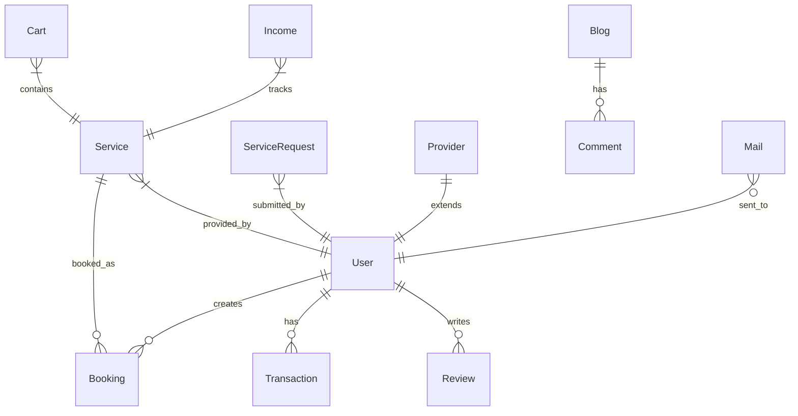

# HelperBuddy — Complete Codebase Analysis

> **HelperBuddy** is a full-stack home services marketplace built with Next.js (Pages Router), MongoDB, and Razorpay. It connects customers with service providers (plumbing, cleaning, repairs, etc.) with an admin panel for oversight.

---

## A) COMPLETE TECH STACK DETECTED

| Layer | Technology | Evidence |
|-------|-----------|----------|
| **Framework** | Next.js 15.1.6 (Pages Router) | `package.json`, `src/pages/` directory |
| **Language** | TypeScript + JavaScript (mixed) | `.ts`, `.tsx`, `.js` files coexist |
| **Frontend UI** | React 18.2, MUI 6.4, Heroicons, Lucide, React Icons | `package.json` imports |
| **Styling** | TailwindCSS 3.4.17 + Emotion (for MUI) | `tailwind.config.ts`, `@emotion/*` |
| **Animations** | Framer Motion 10.18 | `ScrollToTop.tsx`, homepage |
| **Database** | MongoDB Atlas (Mongoose 8.10) | `lib/mongodb.ts`, `lib/dbConnect.ts` |
| **Authentication** | Custom OTP via Resend email + bcryptjs hashing | `api/auth.ts`, `api/auth/signup.ts` |
| **Payment Gateway** | Razorpay 2.9.5 | `api/razorpay.ts` |
| **Email Service** | Resend 4.1.2 | `api/auth.ts` — OTP + welcome emails |
| **SEO** | next-seo 6.6, sitemap 8.0, JSON-LD | `config/seo.config.ts`, `JsonLd.tsx` |
| **State Management** | React Context API (CartContext) | `context/CartContext.tsx` |
| **Charts** | Recharts 2.15 | `admin-income/page.tsx` |
| **Notifications** | react-toastify 11, SweetAlert2 11 | Product page, various components |
| **Carousel** | react-multi-carousel | `package.json` |
| **ID Generation** | uuid v11 | `api/auth/signup.ts` |
| **Utility** | clsx + tailwind-merge (cn helper) | `lib/utils.ts` |
| **Font** | Inter (Google Fonts via next/font) | `app/layout.tsx` |
| **Deployment** | Vercel-ready (Next.js defaults) | `next.config.js` |

---

## B) COMPLETE FEATURE LIST (Detected from Code)

### 1. Authentication & Authorization
- **OTP-based email verification** via Resend API (`api/auth.ts`)
- **User signup** with bcrypt password hashing, salt rounds = 10 (`api/auth/signup.ts`)
- **Service Provider signup** with separate registration flow, salt rounds = 12 (`api/provider/signup.ts`)
- **UUID-based user IDs** instead of MongoDB ObjectId (`uuid v4`)
- **Admin login** — currently a simple form redirect, no real auth validation (`admin/login.tsx`)

### 2. Multi-Role System (3 roles)
- **Customer** — browses services, adds to cart, books, reviews
- **Service Provider** — registers business, submits service requests, has dashboard with income/contracts/reviews
- **Admin** — manages everything from admin panel

### 3. Service Management (Full CRUD)
- **Create**: `POST /api/services` and `POST /api/add`
- **Read**: `GET /api/services`, `GET /api/[id]`, `GET /api/service-user`
- **Update**: `PUT /api/[id]` with validators
- **Delete**: `DELETE /api/[id]`
- Admin manages via `admin/manage-services/page.tsx`

### 4. Service Request Workflow (Provider → Admin Approval)
- Providers submit service requests → stored in `ServiceRequest` collection
- Admin views pending requests (`admin/service-partners/page.tsx`)
- **Accept**: copies to `Service` collection, deletes request (`api/serviceRequest/accept.ts`)
- **Decline**: deletes request (`api/serviceRequest/decline.ts`)

### 5. Shopping Cart System
- **Add to cart**: `POST /api/cart` — checks for duplicates
- **View cart**: `GET /api/cart` — sorted by creation date
- **Remove from cart**: `DELETE /api/cart?id=xxx`
- **Cart Context** (`CartContext.tsx`): global cart count state with increment/decrement
- **Cart summary** with 10% discount calculation and checkout flow

### 6. Payment Integration (Razorpay)
- `POST /api/razorpay` — creates Razorpay order
- Converts amount to paise (×100), auto-capture enabled
- Uses env vars: `RAZORPAY_KEY_ID`, `RAZORPAY_KEY_SECRET`

### 7. Wallet & Transaction System
- **MongoDB transactions** with sessions for atomicity (`api/transaction.ts`)
- Credit/debit operations update user `walletBalance`
- `$inc` operator for atomic balance updates
- Admin can add funds to user wallets (`admin/referall-wallet/page.tsx`)

### 8. Referral System
- Users have `referralCode` and `referralCount` fields
- Admin can generate new referral codes (client-side: `NAME` prefix + random number)
- Referral tracking via user table in admin panel

### 9. Blog System (Full CRUD)
- **Create/Read/Delete** blogs via `api/blog.ts`
- **Read single**: `GET /api/blog/[id]`
- Blog limit: max 10 blogs enforced in frontend
- Admin blog management with edit/delete (`admin/blogs/page.tsx`)
- Public blog listing and detail pages (`components/blog/`)

### 10. Review & Comment System
- **Reviews**: `GET /api/reviews/[productId]` — fetches by product with user population
- **Comments**: CRUD with like functionality (`api/comments.ts`)
- Like uses `$inc: { likes: 1 }` atomic update
- Hardcoded reviews on product page (demo data)

### 11. Mail System (Internal)
- Internal mail with inbox/sent tabs (`admin/mails/page.tsx`)
- Priority levels: low, medium, high
- Admin compose with order ID and provider ID linking
- Mail model supports `isRead`, `isStarred`, `isAdminSent` flags

### 12. Income Dashboard
- Revenue trend charts using Recharts (LineChart)
- Stats: Total Revenue, Active Users, Service Providers
- Growth % calculation vs previous month
- Currently uses hardcoded demo data

### 13. SEO Implementation
- `DefaultSeo` component in `_app.tsx`
- Page-level SEO with `NextSeo` on homepage
- JSON-LD structured data component (`JsonLd.tsx`)
- Dynamic sitemap generation (`api/sitemap.ts`)
- Custom `_document.tsx` with meta tags, manifest, theme-color

### 14. UI/UX Features
- **Loading bar** with animated progress (`LoadingBar.tsx`)
- **Scroll-to-top** button with Framer Motion animations
- **Search bar** with clear button (`SearchBar.tsx`)
- **Responsive layout** with conditional rendering (admin vs user)
- **Product cards** with hover scale effects
- **Toast notifications** for cart actions
- **Image optimization** via Next.js `<Image>` with remote patterns

### 15. Address & Checkout Flow
- Address component at `/components/Address/index.tsx`
- Cart passes `totalAmount` as query param to checkout

---

## C) COMPLETE PROJECT FLOW

### User Flow
```
Homepage → Browse Services → Search/Filter → View Product Details
  → Add to Cart → View Cart (10% discount applied) → Enter Address
  → Razorpay Payment → Booking Created
```

### Service Provider Flow
```
Provider Signup (with bank info, categories, location)
  → OTP Verification → Dashboard Access
  → Submit Service Request → Admin Reviews
  → If Accepted: Service goes live
  → Track Income, Reviews, Contracts, Mails
```

### Admin Flow
```
Admin Login → Dashboard with sidebar navigation:
  ├── Service Partners: Accept/Decline service requests
  ├── Manage Services: CRUD on all services
  ├── Referral & Wallet: View users, add funds, generate referral codes
  ├── Income: Revenue charts, user/provider growth
  ├── Blogs: Create/Edit/Delete (max 10)
  └── Mails: Inbox/Sent, compose with priority
```

### Database Architecture


### API Route Map

| Route | Methods | Purpose |
|-------|---------|---------|
| `/api/auth` | POST | Send/verify OTP |
| `/api/auth/signup` | POST | User registration |
| `/api/provider` | GET, POST | Provider CRUD |
| `/api/provider/signup` | POST | Provider registration |
| `/api/services` | GET, POST | List/create services |
| `/api/[id]` | GET, PUT, DELETE | Single service CRUD |
| `/api/service-user` | GET | List services (array response) |
| `/api/serviceRequest` | GET, POST | Service requests |
| `/api/serviceRequest/accept` | POST | Admin accept request |
| `/api/serviceRequest/decline` | DELETE | Admin decline request |
| `/api/cart` | GET, POST, DELETE | Cart operations |
| `/api/razorpay` | POST | Create payment order |
| `/api/booking` | GET, POST | Booking CRUD |
| `/api/transaction` | GET, POST | Wallet transactions |
| `/api/users` | GET, POST | User CRUD |
| `/api/blog` | GET, POST, DELETE | Blog CRUD |
| `/api/blog/[id]` | GET | Single blog |
| `/api/reviews/[productId]` | GET | Product reviews |
| `/api/comments` | GET, POST, DELETE | Comments + likes |
| `/api/mail` | GET, POST | Mail system |
| `/api/income` | GET | Income data |
| `/api/sitemap` | GET | XML sitemap |

### MongoDB Models (10 collections)

| Model | Key Fields | Relationships |
|-------|-----------|---------------|
| **User** | businessName, email, phone, password, serviceCategories | Referenced by Booking, Transaction |
| **Provider** | name, categories[], contact, location, bank_info, user_info | Extends User concept |
| **Service** | name, description, price, category, available, providerId | Refs User as provider |
| **ServiceRequest** | Same as Service (staging table) | Pending approval |
| **Booking** | title, client, status, price, dates, address, userId, serviceId | Refs User + Service |
| **Cart** | productId, name, description, price, imageUrl | Unique by productId |
| **Transaction** | userId, type(credit/debit), amount, description | Refs User |
| **Blog** | title, date, excerpt, content, image, author | Standalone |
| **Comment** | user, avatar, rating(1-5), comment, likes | Standalone |
| **Mail** | type, subject, sender, recipient, priority, isRead, isStarred | Standalone |
| **Review** | productId, userId, rating(1-5), comment | Refs service_users + users |
| **Income** | name, earnings, productId, customerId, orders, avgOrderValue | Analytics |

---

## D) KEY FILE-WISE EXPLANATION

### `lib/mongodb.ts` — Connection Pooling
Uses global caching pattern (`(global as any).mongoose`) to prevent multiple connections in serverless/hot-reload environments. **Interview importance**: Shows understanding of serverless connection management.

### `api/auth.ts` — OTP Flow
In-memory OTP store (`Record<string, string>`). Sends OTP via Resend, verifies, then sends welcome email. **Interview importance**: Discuss why in-memory store is problematic in production (stateless serverless).

### `api/transaction.ts` — MongoDB Transactions
Uses `mongoose.startSession()` + `session.startTransaction()` for atomic wallet operations. **Interview importance**: Demonstrates ACID compliance knowledge with MongoDB sessions.

### `api/serviceRequest/accept.ts` — Approval Workflow
Copies ServiceRequest → Service, then deletes the request. Two-step atomic pattern. **Interview importance**: Shows workflow state machine understanding.

### `context/CartContext.tsx` — Global State
React Context with `useState` + `useEffect` for cart count. Exposes `incrementCartCount`/`decrementCartCount`. **Interview importance**: Explains state management choice over Redux.

### `pages/admin/AdminLayout.tsx` — Layout Composition
Conditional sidebar rendering based on route. Uses `useRouter` for active state detection. **Interview importance**: Demonstrates layout composition patterns.

### `hooks/usePageLoad.ts` — Custom Hook
Tracks all image load states to determine when page is fully loaded. **Interview importance**: Shows custom hook design and DOM interaction in React.
